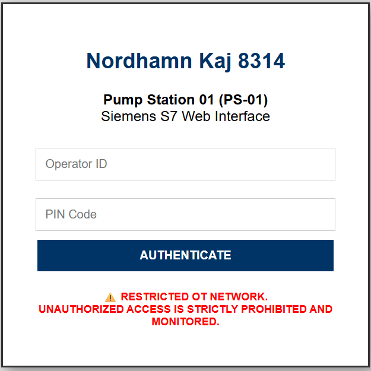

# ⚓ Nordhamn Oil Transfer (OT) Simulator

<div align="center">
  
  
  
  
  
</div>

---

## 📖 Om Projektet
Detta projekt fokuserar på att emulera de industriella styrsystemen (OT) vid en simulerad hamn "Nordhamn" och dess Oljeterminal, Kaj 8314. Syftet är att skapa en höginteraktiv honeypot som simulerar en Siemens S7-PLC för att studera exponering av kritiska protokoll och nätverksinteraktioner i en kontrollerad miljö. Projektet är designat som en modern Security Operations Center (SOC)-pipeline, där sensorer samlar in data som sedan övervakas, visualiseras och analyseras.

## 🧠 Metodik & AI som "Force Multiplier"
Min kärnkompetens i detta projekt ligger på den teoretiska förståelsen för OT-säkerhet – arkitektur, nätverkssegmentering, hotmodellering och driftsäkerhet.

För att översätta denna teoretiska kunskap till praktiskt utförande (avancerad Linux-härdning, reverse-engineering av XML-scheman och Docker-orkestrering) har jag aktivt använt LLM-verktyg som en teknisk sparringpartner. Detta demonstrerar inte bara implementering av OT-säkerhetsprinciper i praktiken, utan bevisar också förmågan att agilt använda modern AI för att snabbt och säkert realisera komplexa säkerhetsarkitekturer.

## 🛠️ Teknisk Stack
* **Simulator:** Conpot v0.6.0 (MushMush Foundation)
* **Monitoring & IDS:** Suricata, Promtail & Loki *(Kommande)*
* **Red Team (Angripare):** Kali Linux på VirtualBox
* **Visualisering:** Grafana *(Kommande)*
* **Infrastruktur:** Docker & Docker Compose
* **Hårdvara:** Raspberry Pi 5 med NVMe-lagring (Sentry-nod)
* **Protokoll:** S7Comm (102), Modbus (502), HTTP (80/8080)

---

## 🗺️ Roadmap: Bygga en Automatiserad SOC
Denna honeypot är fundamentet i en större Threat Intelligence-pipeline.

- [x] **Fas 1: Core Architecture & Frontend** (Custom XML, Web UI, Docker, Edge-konfiguration)
- [x] **Fas 2: Protokoll-Simulering** (Konfigurering av realistiska Modbus-register och S7-noder för "Pump Station 01")
- [x] **Fas 3: Nätverksövervakning & Dashboard** (Suricata IDS & Grafana)
- [ ] **Fas 4: Red Team** (Kali Linux på Virtualbox)
- [ ] **Fas 5: Automatisering av Threat Intel** (Integration av n8n-workflows)
- [ ] **Fas 6: AI-Analys** (AI-agenter som tolkar råa loggfiler och identifierar attackmönster)
- [ ] **Fas 7: Rapportering** (Automatisk export av berikad attackdata till Excel)


## 🏗️ Arkitektur och Spoofing
För att öka trovärdigheten mot angripare har enheten konfigurerats att identifiera sig som en Siemens S7-200/300, en vanlig arbetshäst inom industriell automation. För att fällan ska framstå som en riktig, levande process (High Interaction) har vi definierat 8 specifika Modbus-register som simulerar sensorerna vid oljeterminalen:

* **Register 1001:** Oljenivå Tank (78%)
* **Register 1002:** Pumptryck (5 Bar)
* **Register 1003:** Pumpstatus (1 = Drift)
* **Register 1004:** Flödeshastighet (120 L/min)
* **Register 1005:** Motortemperatur (45°C)
* **Register 1006:** Vibrationsnivå (2 = Normal)
* **Register 1007:** Nödstoppsventil (0 = Öppen)
* **Register 1008:** Systemfel (0 = Inga fel)

ℹ️ Designbeslut: Data Persistence & Kirurgiska Ingrepp
Istället för att låta Docker hantera anonyma volymer, används uttryckliga 'Bind Mounts' på host-systemet. För att kringgå Conpots ibland extremt strikta XML-validering monterar vi vår egen databashjärna (template.xml) och webbportal (index.html) direkt över de inbyggda standardfilerna i containern. Detta kallas för ett kirurgiskt ingrepp och skapar en stabil driftsmiljö.

---------------------------------------------------------------------------------------------------------------------------------------------------------------------------------------------

## 🟢 FAS 1: Core Architecture & Infrastruktur
Etablering av hårdvara, operativsystem och Docker-miljö.


## 1️⃣ Grundinstallation (Raspberry Pi OS)
Steg:

Installera Raspberry Pi OS Lite (64-bit) direkt på NVMe-enheten via Raspberry Pi Imager.

Under "OS Customization", konfigurera:

Hostname: sentry

Aktivera SSH (lösenordsautentisering för initial setup).

Konfigurera nätverk.

Säkerställ att Pi 5:ans EEPROM är uppdaterad och konfigurerad för NVMe-boot.

Installera därefter Docker Engine och ge din användare behörighet (kräver ut- och inloggning för att gälla):

```Bash
curl -fsSL https://get.docker.com -o get-docker.sh && sudo sh get-docker.sh
sudo usermod -aG docker $USER
```
ℹ️ Designbeslut: Edge Computing & Lagringsarkitektur (NVMe)
En honeypot-sensor som emulerar OT-miljöer och kör nätverksanalys genererar intensiva I/O-operationer. Ett traditionellt MicroSD-kort degraderas snabbt. Genom att utrusta Sentry-noden med en NVMe HAT och boota OS direkt från en M.2 SSD säkerställs industriell stabilitet och prestanda. Då Conpot är byggt för x86, hanterar Docker automatiskt emulering via qemu-user-static på vår ARM64-arkitektur.

---------------------------------------------------------------------------------------------------------------------------------------------------------------------------------------------

## 2️⃣ Projektstruktur & Volymer
För att säkerställa att loggar och processdata från Sentry-noden inte försvinner om en container startas om, sätter vi upp en strikt katalogstruktur på NVMe-enheten (Bind Mounts).

```Bash
mkdir -p ~/nordhamn-ot/{conpot_logs,suricata_logs,loki_data,grafana_data,nordhamn/http/htdocs}
cd ~/nordhamn-ot
```

ℹ️ Designbeslut: Data Persistence (Bind Mounts vs Volumes)
Istället för att låta Docker hantera anonyma volymer, används uttryckliga 'Bind Mounts' på host-systemet. Detta gör det mycket enklare för en administratör att direkt komma åt, backa upp eller rensa specifika loggfiler utan att behöva interagera med Dockers interna filsystem.

---------------------------------------------------------------------------------------------------------------------------------------------------------------------------------------------

## 🟡 FAS 2: Protokoll-Simulering & Frontend
Konfigurering av realistiska Modbus-register, S7-noder och webbportal.

## 3️⃣ Skapa Databashjärnan (Custom XML)
För att Conpot ska veta vilka Modbus-register den ska exponera (och vad pumpstationen heter), skapar vi en skräddarsydd template.xml.

```Bash
cat << 'EOF' > nordhamn/template.xml
<core>
    <template>
        <entity name="unit">S7-200</entity>
        <entity name="vendor">Siemens</entity>
        <entity name="description">Nordhamn Oil Terminal - Pump Controller</entity>
        <entity name="protocols">HTTP, MODBUS, s7comm, SNMP</entity>
        <entity name="creator">Nordhamn OT</entity>
    </template>
    <databus>
        <key_value_mappings>
            <key name="FacilityName"><value type="value">"Nordhamn Terminal"</value></key>
            <key name="SystemName"><value type="value">"Central Pump"</value></key>
            <key name="SystemDescription"><value type="value">"Pump Control Unit"</value></key>
            <key name="Uptime"><value type="function">conpot.emulators.misc.uptime.Uptime</value></key>
            <key name="sysObjectID"><value type="value">"0.0"</value></key>
            <key name="sysContact"><value type="value">"Nordhamn Admin"</value></key>
            <key name="sysName"><value type="value">"Pump Control Unit"</value></key>
            <key name="sysLocation"><value type="value">"Nordhamn"</value></key>
            <key name="sysServices"><value type="value">"72"</value></key>
            <key name="OilTankLevel"><value type="value">78</value></key>
            <key name="PumpPressure"><value type="value">5</value></key>
            <key name="PumpStatus"><value type="value">1</value></key>
            <key name="FlowRate"><value type="value">120</value></key>
            <key name="MotorTemperature"><value type="value">45</value></key>
            <key name="VibrationLevel"><value type="value">2</value></key>
            <key name="EmergencyValve"><value type="value">0</value></key>
            <key name="SystemFault"><value type="value">0</value></key>
        </key_value_mappings>
    </databus>
</core>
EOF

```

---------------------------------------------------------------------------------------------------------------------------------------------------------------------------------------------

## 4️⃣ Web Portal Injection (High Interaction)
För att lura angripare injiceras en hårdkodad och trovärdig inloggningssida för "Nordhamn Kaj 8314". HTML-koden måste vara helt ren från otillåtna ASCII-tecken.

```Bash
cat << 'EOF' > nordhamn/http/htdocs/index.html
<!DOCTYPE html>
<html>
<head>
<title>Nordhamn Oil Terminal - PS-01</title>
<style>
body { font-family: Arial, sans-serif; background-color: #e0e0e0; text-align: center; margin-top: 100px; }
.login-box { background: white; width: 350px; margin: auto; padding: 30px; border: 2px solid #333; box-shadow: 5px 5px 15px #888; }
h2 { color: #003366; }
input[type="text"], input[type="password"] { width: 90%; padding: 10px; margin: 10px 0; border: 1px solid #ccc; }
input[type="submit"] { width: 95%; padding: 10px; background: #003366; color: white; border: none; font-weight: bold; cursor: pointer; }
input[type="submit"]:hover { background: #002244; }
.warning { font-size: 12px; color: red; margin-top: 20px; font-weight: bold; }
</style>
</head>
<body>
<div class="login-box">
<h2>Nordhamn Kaj 8314</h2>
<p><strong>Pump Station 01 (PS-01)</strong><br>Siemens S7 Web Interface</p>
<form action="/login_failed" method="POST">
<input type="text" name="username" placeholder="Operator ID" required>
<input type="password" name="password" placeholder="PIN Code" required>
<input type="submit" value="AUTHENTICATE">
</form>
<p class="warning">&#9888;&#65039; RESTRICTED OT NETWORK.<br>UNAUTHORIZED ACCESS IS STRICTLY PROHIBITED AND MONITORED.</p>
</div>
</body>
</html>
EOF
```

För att containerns begränsade användare ska kunna läsa filen sätter vi rättigheterna:

```Bash
chmod -R 777 nordhamn/http/htdocs
```

**Resultatet i webbläsaren:**




ℹ️ Designbeslut: Web Portal Injection
Istället för att låta simulatorn spotta ut tomma sidor eller standardiserade felkoder, möts angriparen av en autentisk Siemens-inloggningssida. Detta ökar markant chansen att samla in värdefulla inloggningsförsök (brute-force data) då angriparen tror sig ha hittat ett kritiskt styrsystem.

---------------------------------------------------------------------------------------------------------------------------------------------------------------------------------------------

## 5️⃣ Orchestration med Docker Compose
Slutligen knyts hela miljön ihop. Vi använder den moderna, stabila ghcr.io-imagen och utför ett kirurgiskt ingrepp genom att skriva över standardfilerna inuti containern med våra skräddarsydda filer.

```Bash
cat << 'EOF' > docker-compose.yml
services:
  conpot:
    image: ghcr.io/telekom-security/conpot:24.04.1
    container_name: nordhamn_conpot
    restart: unless-stopped
    environment:
      - CONPOT_TMP=/tmp
      - CONPOT_JSON_LOG=/var/log/conpot/conpot.json
    ports:
      - '80:80'       # HTTP (Webbgränssnitt / HMI)
      - '102:102'     # S7Comm (Siemens PLC)
      - '502:502'     # Modbus (Pumpstyrning)
      - '161:161/udp' # SNMP (Övervakning)
    volumes:
      - ./conpot_logs:/var/log/conpot
      - ./nordhamn/template.xml:/usr/lib/python3.11/site-packages/conpot/templates/default/template.xml
      - ./nordhamn/http/htdocs/index.html:/usr/lib/python3.11/site-packages/conpot/templates/default/http/htdocs/index.html
    command: conpot --template default --config /etc/conpot/conpot.cfg --logfile /var/log/conpot/conpot.log --temp_dir /tmp
EOF
```

---------------------------------------------------------------------------------------------------------------------------------------------------------------------------------------------

## 6️⃣ Starta och Verifiera
Starta hela OT-nätverket i bakgrunden:

```Bash

sudo docker compose up -d
```

Verifiera att webbservern och fällan fungerar genom att begära sidan lokalt (eller surfa till enhetens IP-adress i en webbläsare):

```Bash
curl -L http://localhost
```

---------------------------------------------------------------------------------------------------------------------------------------------------------------------------------------------

## 🟠 FAS 3: Nätverksövervakning & Dashboard
Implementering av IDS (Suricata) och PLG-stack för loggvisualisering.

## 7️⃣ Bygga Kontrollrummet (SOC & Nätverksövervakning)
För att förvandla fällan till en fullfjädrad SOC (Security Operations Center) lägger vi till nätverksövervakning och visuell logghantering. Vi använder Suricata som IDS (Intrusion Detection System) i host-läge för att fånga upp Nmap-skanningar och exploits. För att visualisera detta använder vi en PLG-stack (Promtail, Loki, Grafana).

Rättigheter för databaserna
Grafana och Loki är strikta med vem som får skriva i deras mappar. Vi ger databaserna full skrivrättighet till de mappar vi skapade tidigare:

```Bash
chmod -R 777 ~/nordhamn-ot/loki_data ~/nordhamn-ot/grafana_data
```

Konfigurera Logg-agenten (Promtail)
Promtail agerar "postiljon" och skickar loggarna från Conpot och Suricata vidare till vår Loki-databas.

```Bash
cat << 'EOF' > ~/nordhamn-ot/promtail-config.yaml
server:
  http_listen_port: 9080
  grpc_listen_port: 0

positions:
  filename: /tmp/positions.yaml

clients:
  - url: http://loki:3100/loki/api/v1/push

scrape_configs:
  - job_name: conpot
    static_configs:
      - targets:
          - localhost
        labels:
          job: conpot
          __path__: /var/log/conpot/*.json
  - job_name: suricata
    static_configs:
      - targets:
          - localhost
        labels:
          job: suricata
          __path__: /var/log/suricata/eve.json
EOF
```

## 8️⃣ Den Kompletta SOC-Infrastrukturen
Vi skapar nu vår slutgiltiga docker-compose.yml som knyter ihop fällan (Conpot), övervakningskameran (Suricata) och kontrollrummet (PLG-stacken).

ℹ️ Designbeslut: Suricata i Host Mode
För att Suricata ska kunna se all inkommande trafik mot Raspberry Pi:n (och inte bara Dockers interna, isolerade trafik), körs containern med network_mode: "host" och knyts direkt till Wi-Fi-gränssnittet (wlan0).

```Bash
cat << 'EOF' > ~/nordhamn-ot/docker-compose.yml
services:
  conpot:
    image: ghcr.io/telekom-security/conpot:24.04.1
    container_name: nordhamn_conpot
    restart: unless-stopped
    environment:
      - CONPOT_TMP=/tmp
      - CONPOT_JSON_LOG=/var/log/conpot/conpot.json
    ports:
      - '80:80'
      - '102:102'
      - '502:502'
      - '161:161/udp'
    volumes:
      - ./conpot_logs:/var/log/conpot
      - ./nordhamn/template.xml:/usr/lib/python3.11/site-packages/conpot/templates/default/template.xml
      - ./nordhamn/http/htdocs/index.html:/usr/lib/python3.11/site-packages/conpot/templates/default/http/htdocs/index.html
    command: conpot --template default --config /etc/conpot/conpot.cfg --logfile /var/log/conpot/conpot.log --temp_dir /tmp

  suricata:
    image: jasonish/suricata:latest
    container_name: nordhamn_suricata
    restart: unless-stopped
    network_mode: "host"
    cap_add:
      - NET_ADMIN
      - NET_RAW
      - SYS_NICE
    volumes:
      - ./suricata_logs:/var/log/suricata
    command: -i wlan0

  loki:
    image: grafana/loki:2.9.2
    container_name: nordhamn_loki
    restart: unless-stopped
    ports:
      - "3100:3100"
    volumes:
      - ./loki_data:/loki

  promtail:
    image: grafana/promtail:2.9.2
    container_name: nordhamn_promtail
    restart: unless-stopped
    volumes:
      - ./promtail-config.yaml:/etc/promtail/config.yml
      - ./conpot_logs:/var/log/conpot:ro
      - ./suricata_logs:/var/log/suricata:ro
    command: -config.file=/etc/promtail/config.yml

  grafana:
    image: grafana/grafana:latest
    container_name: nordhamn_grafana
    restart: unless-stopped
    ports:
      - "3000:3000"
    volumes:
      - ./grafana_data:/var/lib/grafana
EOF
```

## 9️⃣ Driftsättning och Verifiering
Starta upp hela SOC-miljön:

```Bash
cd ~/nordhamn-ot
sudo docker compose up -d
```

Ladda Hot-signaturer till IDS
För att Suricata ska veta vad som är skadlig trafik måste den laddas med de senaste attackreglerna (Emerging Threats). Kör uppdateringen inuti containern och starta sedan om den för att läsa in minnet:

```Bash
sudo docker exec nordhamn_suricata suricata-update
sudo docker restart nordhamn_suricata
```

Konfigurera Grafana Dashboard
Surfa in på http://<DIN-PI-IP>:3000 i en webbläsare.

Logga in med standarduppgifterna (admin / admin).

Navigera till Connections -> Data sources i vänstermenyn.

Klicka på Add data source och välj Loki.

Fyll i URL: http://loki:3100

Klicka på Save & test. (Ett grönt meddelande bekräftar anslutningen).

Fällan är nu fullt operativ, övervakad och redo för Red Team-övningar!

---------------------------------------------------------------------------------------------------------------------------------------------------------------------------------------------

## 🔴 FAS 4: Red Team (Attack-simulering)
Simulering av angrepp från Kali Linux för att verifiera detektion och loggning.

